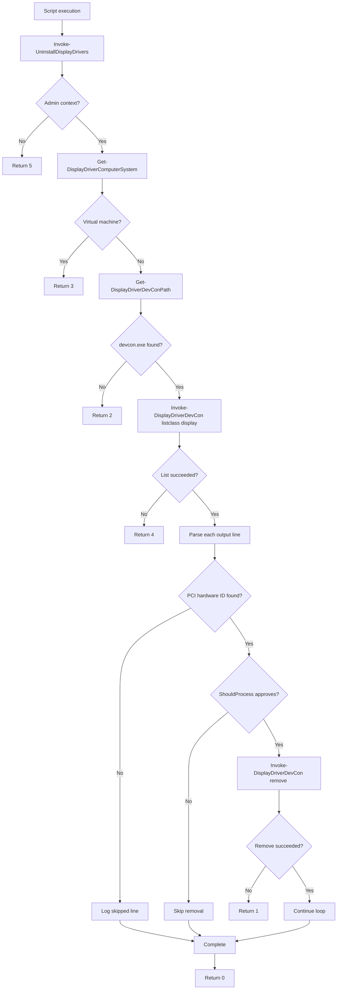

# Script Architecture Overview

This document explains how the `powershell-driver-management` repository works today.

It is written primarily for portfolio reviewers who want to understand the script as a deliberately designed operational tool rather than as a one-off utility. It should also help future maintainers quickly orient themselves before making changes.

## Why This Helps As A Portfolio Project

For a portfolio reviewer, the most useful takeaway is that the repository demonstrates more than a simple hardware-management script.

The project shows:

- a real deployment-driven problem translated into a focused automation tool
- a single-file delivery shape that still preserves internal structure and testability
- explicit operational safety guardrails around elevation, dependencies, and virtual machines
- ConfigMgr-aware exit-code design instead of generic success or failure handling
- helper-level decomposition that keeps the script maintainable without losing its deployment form

That is the main reason a script architecture overview adds value here: it makes the design choices visible, not just the script's purpose.

## Why This Script Is Worth Mapping

The repository solves a narrow problem, but it does so with a deliberate shape:

- one deployable script kept compatible with ConfigMgr Scripts deployment
- helper functions inside that script to isolate environment checks, dependency resolution, command execution, and parsing
- explicit numeric exit codes aligned to operational reporting needs
- `ShouldProcess` support for safer validation through `-WhatIf`
- unit tests that validate logic without needing the real `devcon.exe`

That structure is part of the portfolio value of the repository. The code is not just invoking `devcon.exe` blindly. It is organized so that environment validation, device enumeration, hardware-ID extraction, and removal behavior can be reviewed and tested with clear boundaries.

## Script Load And Execution Model

This repository is centered on a single deployable script:

- `src/Public/Uninstall-DisplayDrivers.ps1`

That single-file shape is intentional because the intended deployment target is Microsoft Configuration Manager Scripts.

The script keeps two layers:

- helper functions for environment inspection, dependency discovery, command invocation, and parsing
- one orchestration entrypoint, `Invoke-UninstallDisplayDrivers`, which returns the numeric outcome code

At the bottom of the file, the script detects whether it is being dot-sourced or executed normally. When executed directly, it exits the host process with the return value from `Invoke-UninstallDisplayDrivers`.

That preserves the operational requirement that ConfigMgr receives a meaningful process exit code while still keeping the script testable.

## Runtime Workflow

The script's execution flow is deliberately linear and defensive.

### 1. Administrative Context Check

`Invoke-UninstallDisplayDrivers` first verifies that the script is running in an elevated administrative context.

If not, it writes an informational message and returns exit code `5`.

### 2. Virtual Machine Guardrail

The script retrieves `Win32_ComputerSystem` data and checks manufacturer and model values against the known virtual-machine list.

If the system appears to be virtualized, it writes an informational message and returns exit code `3`.

### 3. Dependency Resolution

The script resolves `devcon.exe` relative to the script directory rather than assuming it is globally installed.

If `devcon.exe` is missing, it returns exit code `2`.

### 4. Display Device Enumeration

The script runs:

- `devcon.exe listclass display`

If the query fails or returns an unusable result, it returns exit code `4`.

### 5. Hardware-ID Extraction And Removal

For each returned line, the script:

- trims the line
- extracts a matching PCI hardware ID when present
- skips informational lines that do not match the display-device pattern
- uses `ShouldProcess` before attempting removal
- calls `devcon.exe remove <hardware-id>` for matching display adapters

If removal fails for any targeted adapter, the script returns exit code `1`.

If the workflow completes successfully, it returns exit code `0`.

## Runtime Flow

## Core Contracts That Matter

Although this repository does not expose a formal module API, it still has several important runtime contracts.

### Exit-Code Contract

The script is intentionally designed around explicit exit codes:

- `0` = success
- `1` = general failure
- `2` = dependency missing
- `3` = virtual machine detected
- `4` = display enumeration failed
- `5` = administrative context required

This contract is a central part of the design because it lets ConfigMgr report outcomes in a more meaningful way than a generic script failure would.

### Dependency Contract

The script expects `devcon.exe` to be present beside the script at runtime.

That local dependency model keeps the deployable artifact simple and predictable for the original deployment scenario.

### Display-Only Scope Contract

The script is intentionally limited to display drivers.

That constraint appears in:

- the `devcon.exe listclass display` query
- the PCI hardware-ID extraction pattern
- the repository documentation and safety framing

The script is safer and easier to reason about because it does not try to generalize itself into a broader driver-management framework.

## Internal Helper Responsibilities

The helper functions are easiest to understand when grouped by responsibility.

### Environment And Safety Checks

These helpers verify whether the script should proceed at all:

- `Get-DisplayDriverComputerSystem`
- `Test-DisplayDriverAdministrativeContext`
- `Test-DisplayDriverVirtualMachine`

They protect the operational boundary before any driver action is attempted.

### Dependency And Native Command Execution

These helpers resolve and call `devcon.exe`:

- `Get-DisplayDriverDevConPath`
- `Invoke-DisplayDriverDevCon`

They keep path resolution and process invocation separate from the higher-level uninstall flow.

### Parsing And Target Selection

This helper isolates the logic that extracts actionable device identifiers:

- `Get-DisplayHardwareIdFromLine`

That separation matters because it keeps the regex-based selection rule testable without invoking the real executable.

### Orchestration

The main workflow lives in:

- `Invoke-UninstallDisplayDrivers`

This function coordinates guardrails, dependency checks, enumeration, removal, logging, and exit-code selection.

## Behavioral Contracts That Matter

Several behaviors are important to understanding the script correctly:

- the script is intended for physical machines and intentionally blocks execution on known VM platforms
- the script is designed for ConfigMgr Scripts deployment, so process exit codes matter as much as console messages
- `ShouldProcess` support allows safer validation with `-WhatIf`
- non-device lines returned by `devcon.exe` are intentionally skipped rather than treated as fatal parsing failures
- tests mock `devcon.exe` interactions so logic can be validated without the real binary in CI

These are part of the design, not just incidental implementation details.
